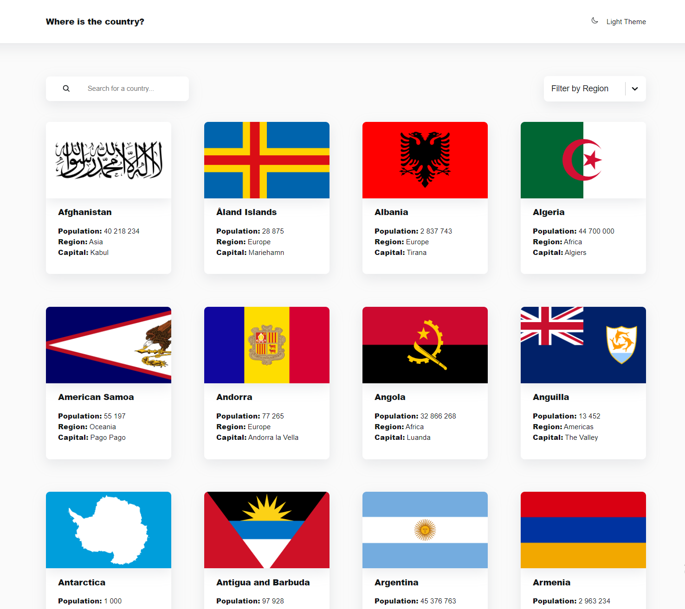
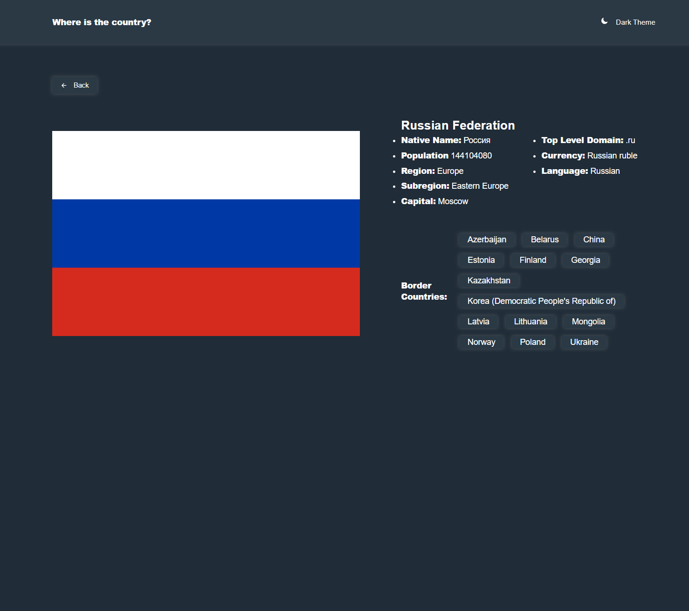
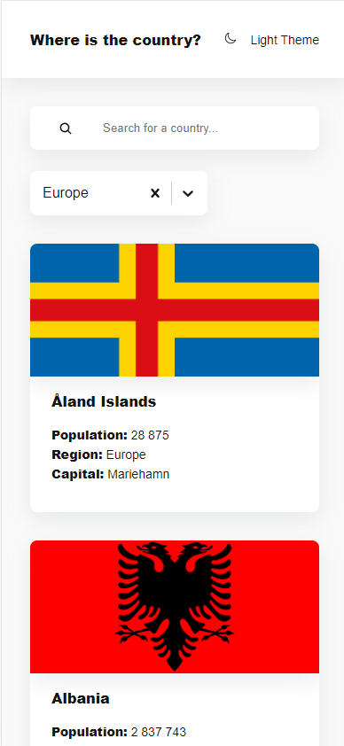

# Where is the country?

## Оглавление

- [Функциональность] (#функциональность)
- [Скриншоты](#скриншоты)
- [Ссылки](#ссылки)

### Функциональность

Пользователи имеют возможность:

- Просматривать все страны из API на главной странице
- Искать страны с помощью строки ввода
- Фильтровать страны по регионам
- Видеть подробную информацию о стране на отдельной странице по клику на карточке
- Просматривать и переходить на пограничные страны на странице с подробной информации о стране
- Переключать цветовую схему между светлой и темной

### Скриншоты

### Ссылки

- Live site URL: 

### Используемые технологии

- Семантическая верстка HTML5
- Кастомные свойства CSS
- Flexbox
- CSS Grid
- Mobile first, ориентация на мобильные устройства
- [React](https://react.dev/) - JS библиотека
- [Styled Components](https://styled-components.com/) - Для стилей
- [Vite](https://vitejs.dev/) - Для сборки проекта
- [axios](https://axios-http.com/docs/intro) - HTTP клиент для осуществления запросов к серверу
- [react-select](https://react-select.com/home) - Библиотка для работы с инпутом выпадающего списка

